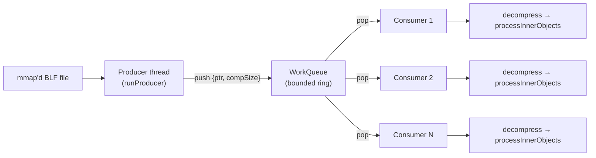
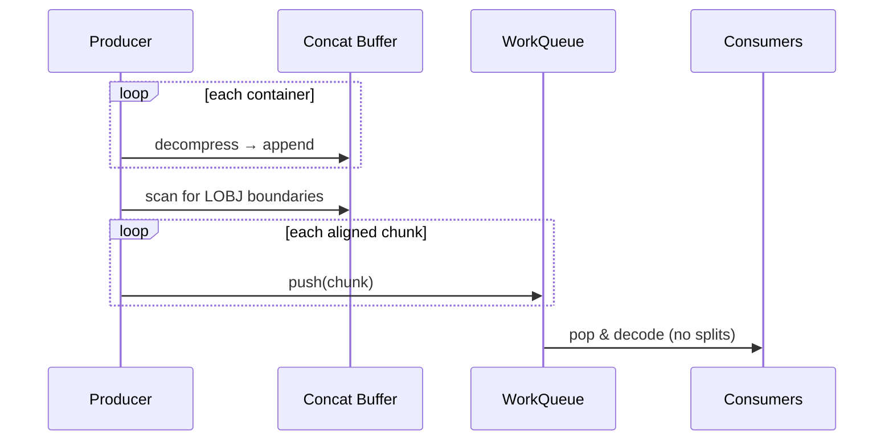
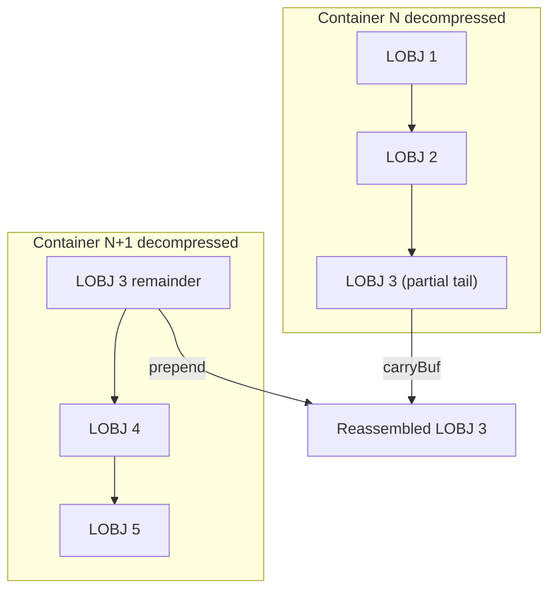
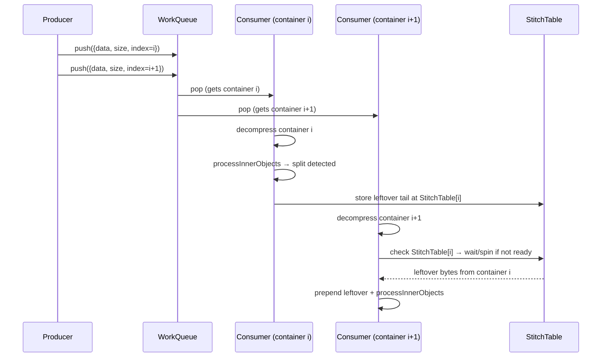
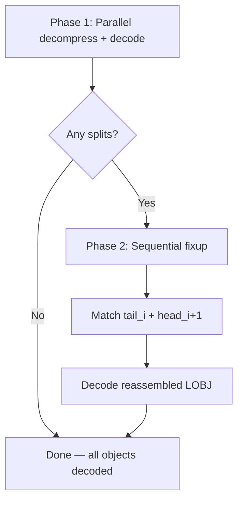

# Design Proposals: Cross-Container Split LOBJ Reassembly

## Problem Statement

In the BLF format, the file consists of a `LOGG` header followed by a sequence of top-level `LOBJ` objects. Most of these are `CONTAINER` (type 10) objects whose payload is zlib-compressed. Inside each decompressed container are the actual log objects (CAN messages, Ethernet frames, etc.).

**The problem:** A single inner LOBJ can be split across two consecutive containers — part of its bytes are at the tail of container N's decompressed payload, and the rest are at the head of container N+1's decompressed payload.

**Current behavior** ([main.cpp:86-94](file:///cpp/src/main.cpp#L86-L94)): When [processInnerObjects](file:///cpp/src/main.cpp#L60-L169) detects a split (`objectEnd > dataLen`), it logs the event, increments a counter, and **breaks** — the split object is silently dropped. Real traces show dozens of these per file.

```
SPLIT: type=120 (ETHERNET_FRAME) objectSize=1550 B | 312 B in this container, 1238 B in next
```

**Goal:** Reassemble and decode these split objects, achieving 100% object coverage.

---

## Architecture Context



Key constraints:
- Containers are pushed to the queue **in file order** by a single producer
- Consumers pop work items **in arrival order** (FIFO), but multiple consumers compete
- A consumer only sees **one** decompressed container at a time — it has no access to the next container's data
- Decompressed data lives in a per-thread scratch buffer that gets reused

---

## Design A: Producer-Side Sequential Pre-Concatenation

### Idea

The **producer** decompresses each container itself (sequentially) and concatenates decompressed buffers into a single contiguous stream before chunking work to consumers.

### How it works

1. Producer decompresses each container into a large append-only buffer
2. After all containers are decompressed, scan the buffer as one contiguous stream
3. Chunk the resulting stream into work units aligned on LOBJ boundaries
4. Push LOBJ-aligned chunks to the work queue; consumers decode without splits



### Trade-offs

| Aspect | Assessment |
|--------|-----------|
| **Correctness** | ✅ Trivially correct — splits are impossible |
| **Memory** | ❌ Requires ~decompressed file size in RAM (e.g. 8 GB file → ~36 GB decompressed) |
| **Performance** | ❌ Serialises decompression in the producer — defeats the pipeline. No overlap of I/O and decompress |
| **Complexity** | ✅ Very simple |
| **Parallelism** | ❌ Decompression is single-threaded; only object decoding is parallelised |

### Verdict
❌ **Not recommended.** Fundamentally breaks the pipeline's I/O-compute overlap and demands enormous memory. Only viable for small files.

---

## Design B: Ordered Consumer with Carry-Forward Buffer

### Idea

Force consumers to process containers **in strict file order** (one at a time, sequentially). Each consumer carries leftover bytes from the previous container's tail and prepends them to the next container's decompressed data.

### How it works

1. Remove multi-threaded consumers; use a single consumer that processes containers in order
2. Maintain a `carryBuf` (small) containing the trailing bytes of the last split object
3. When decompressing container N+1, prepend `carryBuf` to get a contiguous view
4. Process the reassembled stream; if another split is found at the end, save its prefix into `carryBuf`



### Trade-offs

| Aspect | Assessment |
|--------|-----------|
| **Correctness** | ✅ Straightforward — sequential order guarantees reassembly |
| **Memory** | ✅ Only a small carry buffer (~few KB for the largest LOBJ, typically ≤2 KB) |
| **Performance** | ❌ **Single-threaded decompression** — loses all parallelism |
| **Complexity** | ✅ Simple linear logic |
| **Parallelism** | ❌ None — must be sequential |

### Verdict
❌ **Not recommended** for the same reason as Design A: single-threaded decompression bottleneck. However, the carry-buffer concept is sound and reusable.

---

## Design C: Ordered Dispatch with Per-Pair Stitching (Recommended)

### Idea

Keep the multi-threaded pipeline but ensure **adjacent containers can communicate**. The producer assigns a monotonic sequence number to each container. Each consumer, when it detects a split, writes the leftover tail into a shared stitch buffer indexed by sequence number. The consumer that processes the *next* container checks for a stitch buffer from its predecessor and prepends it.

### How it works

1. Producer assigns a sequential `containerIndex` to each work item
2. Add a shared `StitchTable`: `containerIndex → leftover bytes` (concurrent hash map or array)
3. Consumer processing container `i`:
   - **At start:** Check if `StitchTable[i-1]` exists. If so, prepend those bytes to the decompressed buffer before parsing
   - **At end:** If the last LOBJ is split, copy its prefix bytes into `StitchTable[i]`
4. Because container `i+1` might be processed *before* container `i` finishes, the consumer for `i+1` needs to **wait** if `StitchTable[i]` isn't ready yet, or retry at the end

### Detailed flow



### Handling the race condition

The consumer of container `i+1` might start before container `i`'s consumer has written its stitch data. Two sub-options:

**C.1 — Spin/wait approach:**
- `StitchTable` entries have a `std::atomic<State>` flag: `PENDING → NO_SPLIT | HAS_SPLIT`
- Consumer `i` sets it after processing. Consumer `i+1` spins briefly or uses `futex`/`condition_variable`

**C.2 — Deferred completion approach:**
- Consumer `i+1` processes all complete LOBJs in its container first (high work)
- Only at the end, if the first bytes aren't an LOBJ header, it checks `StitchTable[i]`
- If not ready yet, parks on a per-slot condition variable (very rare event)

### Trade-offs

| Aspect | Assessment |
|--------|-----------|
| **Correctness** | ✅ Handles all splits, including chains (split at end of i AND start of i+1) |
| **Memory** | ✅ Stitch entries are tiny (max ~few KB each); table is O(num_containers) pointers |
| **Performance** | ✅ Preserves full pipeline parallelism; stitch wait is rare and brief |
| **Complexity** | ⚠️ Moderate — needs synchronisation for stitch handoff |
| **Parallelism** | ✅ Full multi-threaded decompression and decoding preserved |

### Verdict
✅ **Recommended.** Best balance of correctness, performance, and memory. The synchronisation cost is negligible because splits are infrequent (~0.01% of containers).

---

## Design D: Virtual Contiguous Stream via Scatter-Gather Cursor

### Idea

Extend the `Cursor` abstraction to operate over a **list of non-contiguous buffers** (scatter-gather / iovec style). When an LOBJ spans the boundary between two buffers, the cursor transparently reads across them.

### How it works

1. Pre-decompress all containers into individual buffers (can be parallel)
2. Build an ordered `vector<{ptr, len}>` of all decompressed buffers
3. Create a `ScatterCursor` that provides the same `read()/peek()/skip()` API as `Cursor` but walks across buffer boundaries
4. A single pass over the `ScatterCursor` decodes all LOBJs without splits

```cpp
struct ScatterCursor {
    struct Segment { const char* data; size_t len; };
    std::vector<Segment> segments;
    size_t segIdx = 0;
    size_t posInSeg = 0;

    bool read(void* dst, size_t n); // handles cross-boundary reads
    bool skip(size_t n);
    // ...
};
```

### Trade-offs

| Aspect | Assessment |
|--------|-----------|
| **Correctness** | ✅ Transparent boundary crossing; no split logic needed |
| **Memory** | ❌ All decompressed containers must be held simultaneously (~36 GB for 8 GB file) |
| **Performance** | ⚠️ Adds a branch per `read()` for boundary checks; decoding becomes single-threaded |
| **Complexity** | ⚠️ Moderate — new cursor abstraction + cross-boundary memcpy |
| **Parallelism** | ⚠️ Decompression can be parallel, but decoding must be serial (single cursor) |

### Verdict
⚠️ **Not recommended for this codebase.** Elegant abstraction but requires holding all decompressed data in memory and serialises the decoding phase.

---

## Design E: Hybrid — Optimistic Parallel + Sequential Fixup

### Idea

Process containers in parallel as today (optimistic: most LOBJs are fully contained). Collect split fragments. Run a lightweight sequential fixup pass to reassemble only the split objects.

### How it works

1. **Phase 1 (parallel, unchanged):** Each consumer decompresses and decodes. On detecting a split at the tail, save `{containerIndex, tailBytes}` into a shared `SplitFragment` list. On detecting raw bytes at the head (before the first LOBJ signature), save `{containerIndex, headBytes}`
2. **Phase 2 (sequential, lightweight):** After all consumers finish, iterate through `SplitFragment` pairs: concatenate `tail[i] + head[i+1]`, decode the reassembled LOBJ



### Problem: Head bytes aren't available after Phase 1

The decompressed buffer is reused. The head bytes of container `i+1` are gone by Phase 2.

**Fix:** Each consumer must save the head bytes (up to the first LOBJ boundary) when the container's decompressed data doesn't start with an LOBJ signature. This is a small `memcpy` per affected container.

### Trade-offs

| Aspect | Assessment |
|--------|-----------|
| **Correctness** | ✅ All splits reassembled in fixup pass |
| **Memory** | ✅ Only fragment bytes stored (tiny) |
| **Performance** | ✅ Phase 1 unchanged; Phase 2 is trivial (microseconds for ~dozen splits) |
| **Complexity** | ⚠️ Moderate — must detect/save head fragments + fixup logic |
| **Parallelism** | ✅ Phase 1 fully parallel; Phase 2 serial but negligible |

### Verdict
✅ **Strong alternative.** Almost zero impact on the hot path. Slightly more complex than Design C but avoids any inter-consumer synchronisation during Phase 1.

---

## Design F: Dedicated Stitcher thread for split objects

A variant of Design E is to use a dedicated Stitcher thread to handle split objects. This avoids synchronisation overhead on consumer threads which handle bulk of the messages. At the same time, the Stitcher is likely to finish processing split objects in parallel with consumers, with minimal additional runtime.

---

## Comparison Matrix

| | A: Pre-Concat | B: Sequential | C: Ordered Stitch | D: Scatter Cursor | E: Parallel + Fixup |
|---|:---:|:---:|:---:|:---:|:---:|
| **Correctness** | ✅ | ✅ | ✅ | ✅ | ✅ |
| **Memory overhead** | ❌ ~36 GB | ✅ ~KB | ✅ ~KB | ❌ ~36 GB | ✅ ~KB |
| **Pipeline preserved** | ❌ | ❌ | ✅ | ⚠️ partial | ✅ |
| **Decomp parallelism** | ❌ | ❌ | ✅ | ✅ | ✅ |
| **Decode parallelism** | ✅ | ❌ | ✅ | ❌ | ✅ |
| **Implementation effort** | Low | Low | Medium | Medium | Medium |
| **Hot-path overhead** | N/A | N/A | Negligible | Branch/read | None |
| **Synchronisation needed** | None | None | Per-slot CV | None | None (phase barrier) |

---

## Recommendation

> [!IMPORTANT]
> **Design C (Ordered Stitch)** and **Design E (Parallel + Fixup)** are both strong choices. The decision comes down to a latency vs. simplicity trade-off:

| Choose | When |
|--------|------|
| **Design C** | You want split objects decoded with the same latency as regular objects (online/streaming use case). The stitch is resolved as soon as both adjacent containers are decompressed. |
| **Design E** | You want minimal changes to the current hot path and are OK with split objects being resolved at the end (batch processing use case). Simpler to implement and debug. |

For `fastrace`'s current batch-processing use case (process entire file → print summary), **Design E** is likely the pragmatic first choice due to its simplicity and zero impact on the existing parallel pipeline.

If the codebase later evolves toward streaming/real-time processing, refactoring to **Design C** would be straightforward since the fragment-detection logic from Design E transfers directly.
